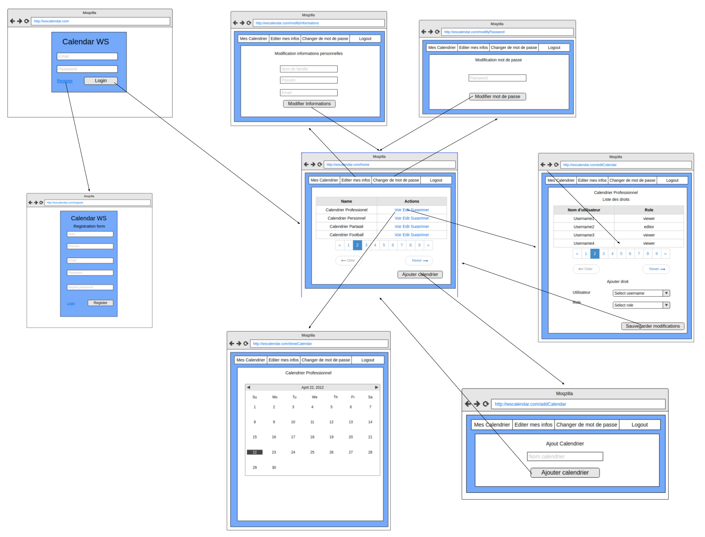
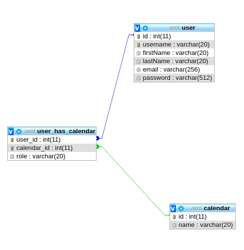

## 1. Introduction

### 1.1 Description du projet

Dans ce projet du module AMT, il nous était demandé de choisir un **business domain** de notre choix et d'en faire un modèle simple avec un petit nombre d'entités de business. Le projet avait pour but de nous apprendre à utiliser les différents méchanismes et notions de **Java EE**.

Nous avons décidé de créer un site web permettant aux utilisateurs de s'inscrire, afin de pouvoir créer des calendriers. Quand ces derniers sont créés, le propriétaire des calendriers peut partager ces derniers aux autres utilisateurs du site avec des droits différents. Ces derniers sont : 

- **Owner** : Le propriétaire du calendrier ayant tous les droits.

- **Viewer** : Permet de voir le calendrier mais de ne pas l'éditer.
- **Editor** : Permet de voir le calendrier et de le modifier.

Malheureusement, nous avons décidé, après avoir discuté avec le professeur et l'assitant, que la création d'événement ne sera pas implémentée.

En plus de la gestion des calendriers, nous avons donné la possibilité à l'utilisateur de :

- Modifier ses informations
- Réinitialiser son mot de passe

### 1.2 Mockup

Ci-dessous, le mockup que nous avons designé durant la première semaine du projet:

### 1.3 Schéma relationnel de la base de données

Pour une meilleure compréhension de notre projet, ci-dessous se trouve le schéma relationnel de la base de données : 

 