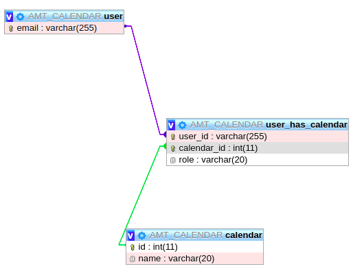
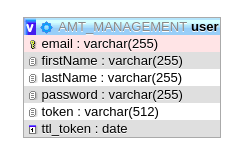

## 1. Introduction

**ATTENTION : ** Nous ne pouvons pas lancer notre projet depuis intellij, mais depuis la ligne de commande `mvn springboot:run`. Nous avons cherché longtemps mais nous ne comprenons pas pourquoi.

### 1.1 Description du projet

Dans ce projet du module AMT, il nous était demandé de reprendre le  **business domain** du projet 1 et de le transformer en deux projets SpringBoot implémentant deux APIs REST bien distinctes et générées sur la base d'une documentation Swagger. De plus, une phase de test utilisant l'outil Cucumber a été demandée et donc implémentée dans chacune des APIs. 

Les différentes APIs ont des endpoints nécessitant une authentification. Cette dernière est gérée par l'API Management et est basée sur des tokens JWT comme demandé dans l'énoncé.

### 1.2 Schéma relationnel de la base de données

Pour une meilleure compréhension de notre projet, ci-dessous se trouve les schémas des bases de données : 

**Base de données de l'API Calendar:**

**Base de données de l'API Management :**

 

